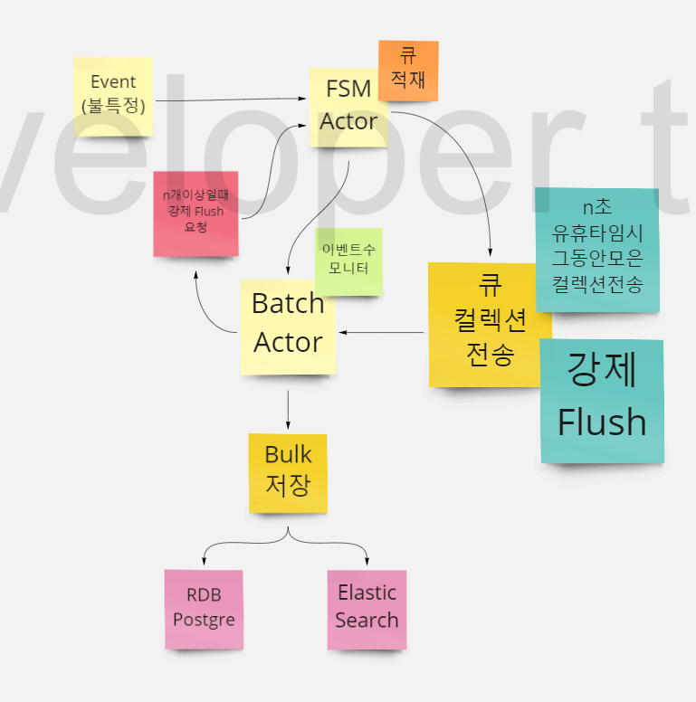
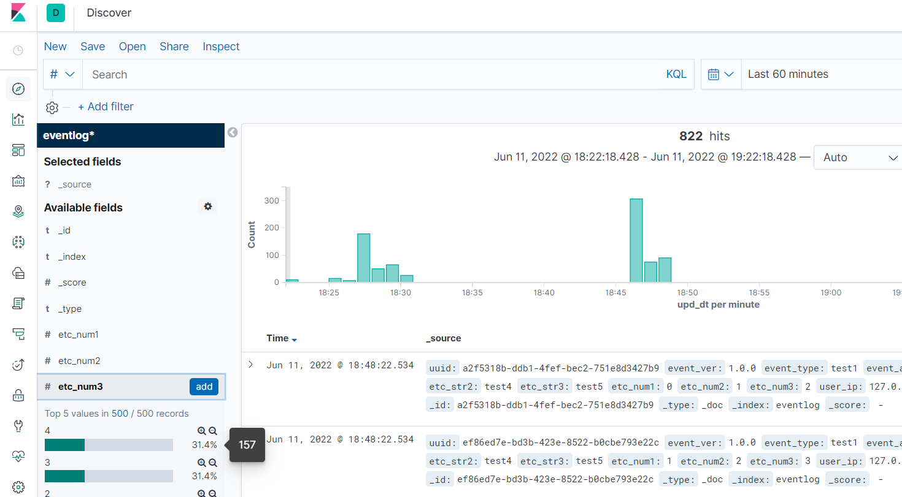

# EventListenerAPI

# 컨셉

활용 : 불특정하게 발생하는 대용량 이벤트를 실시간 고성능으로 저장~

성능고려지점
- 이벤트마다 커넥션을 1사용하는것은 커넥션비용 낭비
- 1번의 이벤트를 100번저장하는것보다, 100개의 데이터를 벌크인서트하는것이 성능 효율
- 불특정 발생하는 이벤트를 배치처리가 아닌, FSM Queue Actor를 활용하여 실시간처리
- DB와 ELK(NOSQL)에 양방향 동시 고성능적재처리

## Log를 통한 실시간 배치저장 살펴보기

- 이벤트가 여러번발생해도, 바로적재하는 것이아닌 이벤트가 없는 유휴시간시 그동안 모은 이벤트를 적재시도
- 이벤트 유휴시간이 없을시 
- 동시성 n개의 이벤트를 대응하지만 데이터저장을 위한 커넥션 1개만사용
- 저장실패시 NLog에 Json데이터 저장(복구용)

<pre>
[2022-06-11 18:48:11.8367] [Info] [PSMON-ASUS] [AKKA] [ACTOR] [EventListenerAPI.Actors.BatchActor] [35] : Queue:80
[2022-06-11 18:48:11.8367] [Info] [PSMON-ASUS] [AKKA] [ACTOR] [EventListenerAPI.Actors.BatchActor] [35] : Queue:81
[2022-06-11 18:48:12.0684] [Info] [PSMON-ASUS] [AKKA] [ACTOR] [EventListenerAPI.Actors.BatchActor] [37] : Queue:82
[2022-06-11 18:48:12.0701] [Info] [PSMON-ASUS] [AKKA] [ACTOR] [EventListenerAPI.Actors.BatchActor] [37] : Queue:83
[2022-06-11 18:48:12.0701] [Info] [PSMON-ASUS] [AKKA] [ACTOR] [EventListenerAPI.Actors.BatchActor] [37] : Queue:84
[2022-06-11 18:48:13.0757] [Info] [PSMON-ASUS] [AKKA] [ACTOR] [EventListenerAPI.Actors.BatchActor] [34] : GetMessageCnt:84
[2022-06-11 18:48:13.2133] [Info] [PSMON-ASUS] [AKKA] [ACTOR] [EventListenerAPI.Services.IndexService] [27] : Elk:BulkInsertAsync Count:84
[2022-06-11 18:48:15.2304] [Info] [PSMON-ASUS] [AKKA] [ACTOR] [EventListenerAPI.Actors.BatchActor] [37] : Queue:1
[2022-06-11 18:48:15.2304] [Info] [PSMON-ASUS] [AKKA] [ACTOR] [EventListenerAPI.Actors.BatchActor] [37] : Queue:2
[2022-06-11 18:48:15.2304] [Info] [PSMON-ASUS] [AKKA] [ACTOR] [EventListenerAPI.Actors.BatchActor] [37] : Queue:3
[2022-06-11 18:48:16.2395] [Info] [PSMON-ASUS] [AKKA] [ACTOR] [EventListenerAPI.Actors.BatchActor] [35] : GetMessageCnt:3
[2022-06-11 18:48:16.3116] [Info] [PSMON-ASUS] [AKKA] [ACTOR] [EventListenerAPI.Services.IndexService] [39] : Elk:BulkInsertAsync Count:3
[2022-06-11 18:48:22.5342] [Info] [PSMON-ASUS] [AKKA] [ACTOR] [EventListenerAPI.Actors.BatchActor] [28] : Queue:1
[2022-06-11 18:48:22.5342] [Info] [PSMON-ASUS] [AKKA] [ACTOR] [EventListenerAPI.Actors.BatchActor] [28] : Queue:2
[2022-06-11 18:48:22.5342] [Info] [PSMON-ASUS] [AKKA] [ACTOR] [EventListenerAPI.Actors.BatchActor] [28] : Queue:3
[2022-06-11 18:48:23.5453] [Info] [PSMON-ASUS] [AKKA] [ACTOR] [EventListenerAPI.Actors.BatchActor] [31] : GetMessageCnt:3
[2022-06-11 18:48:23.6078] [Info] [PSMON-ASUS] [AKKA] [ACTOR] [EventListenerAPI.Services.IndexService] [39] : Elk:BulkInsertAsync Count:3
</pre>

# Code Review
<pre>
        //API : 이벤트 발생 -> FSMActor에 전송
        [HttpPost(nameof(PostEvent))]  
        public async Task<IActionResult> PostEvent(EventLog eventLog)  
        {
            eventLog.uuid = Guid.NewGuid().ToString();
            eventLog.upd_dt = DateTime.Now;
            
            _bridge.Tell(eventLog);            
            return Ok("ok");
        }

        //FSMActor : 이벤트가 n초동안 없을시 저장을 시도
        When(State.Active, state =>
        {
            if ((state.FsmEvent is Flush || state.FsmEvent is StateTimeout) 
                && state.StateData is Todo t)
            {
                return GoTo(State.Idle).Using(t.Copy(ImmutableList<object>.Empty));
            }

            return null;
        }, TimeSpan.FromSeconds(1));

        //BatchActor : FSMActor의 큐가 N개 이상일때, 강제 Flush(배치)처리
        ReceiveAsync<int>( async count => 
        { 
            log.Info( "Queue:" + count );

            if(count > MaxBatchSize)
            {
                if(_fsmActor != null)
                {
                    _fsmActor.Tell(new Flush());
                }                    
            }
        });

        //BatchActor : FSMActor의 상태머신조건에의해 Batch수행...
        ReceiveAsync<Batch>( async message =>
        {
            log.Info( "GetMessageCnt:" + message.Obj.Count.ToString() );

            List<EventLog> eventLogs = new();
            foreach( object data in message.Obj )
            {
                if(data is EventLog) eventLogs.Add((EventLog)data);
            }

            using(var scope = _scopeFactory.CreateScope())
            {
                string processStep = "InQueue";

                try
                {
                    var appDbContext = scope.ServiceProvider.GetRequiredService<AppDbContext>();

                    var indexService = scope.ServiceProvider.GetRequiredService<IndexService>();                    

                    if(eventLogs.Count > 0)
                    {               
                        
                        processStep = "Try appDbContext.BulkInsertAsync";

                        //배치처리 GO
                        await appDbContext.BulkInsertAsync(eventLogs); 

                        processStep = "Try indexService.BulkInsertAsync";
                        
                        await indexService.BulkInsertAsync(eventLogs);
                    }
                        
                }
                catch( Exception ex )
                {
                    var json = JsonSerializer.Serialize(eventLogs);
                    log.Error( processStep + " ==> " + json );
                }
            }
        });

</pre>

# 보너스
본 샘플은 ElasticSearch에 동시저장이 되기때문에
키바나를 활용하여 데이터를 시각화할수 있습니다.

# Local Infra

- Postgre : localhost:5432
- Elk : http://localhost:9200
- Kibana : http://localhost:9400/app/kibana

    infra>docker-compose up -d  -명령으로 LocalFirst 인프라구동

<pre>
version: '3.4'
 
services:

  postgres:
    image: postgres:9.6
    container_name: postgres
    environment:
      - POSTGRES_USER=docker
      - POSTGRES_PASSWORD=docker        
    ports:
      - '5432:5432'
    volumes:
      - postgre-data:/usr/local/psql/data
       
  adminer:
    image: adminer
    restart: always
    ports:
      - 13307:8080
    volumes:
      - "/etc/timezone:/etc/timezone:ro"
      - "/etc/localtime:/etc/localtime:ro"
    
  elasticsearch:
    image: docker.elastic.co/elasticsearch/elasticsearch:7.4.0
    container_name: elasticsearch
    environment:
      - xpack.security.enabled=false
      - discovery.type=single-node
      - "ES_JAVA_OPTS=-Xms1500m -Xmx3000m"
    ulimits:
      memlock:
        soft: -1
        hard: -1
      nofile:
        soft: 65536
        hard: 65536
    cap_add:
      - IPC_LOCK
    volumes:
      - elasticsearch-data:/usr/share/elasticsearch/data
    ports:
      - 9200:9200
      - 9300:9300
      
  kibana:
    container_name: kibana
    image: docker.elastic.co/kibana/kibana:7.4.0
    restart: always
    environment:
      - ELASTICSEARCH_HOSTS=http://elasticsearch:9200
    ports:
      - 9400:5601    
    depends_on:
      - elasticsearch

volumes:
  elasticsearch-data:
    driver: local
  postgre-data:
    driver: local
</pre>

# 참고 링크
- FSM을 이용한 배치처리기:  https://wiki.webnori.com/display/AKKA/Finite+State+Machines
- Akka.net FSM Actor :  https://getakka.net/articles/actors/finite-state-machine.html
- BulkInsert : https://www.c-sharpcorner.com/article/bulk-operations-in-entity-framework-core/
- redshift : https://docs.aws.amazon.com/ko_kr/redshift/latest/dg/r_CREATE_TABLE_examples.html
- Logging : https://github.com/NLog/NLog/wiki/Getting-started-with-ASP.NET-Core-6
